# PR0101: Configuración del entorno

## Fase 0: Arranque del Laboratorio en AWS Academy
Entramos en el curso de **AWS Academy Canvas** y clicamos en el curso que tenemos que en este caso tiene el nombre de **AWS Academy Learner Lab**.

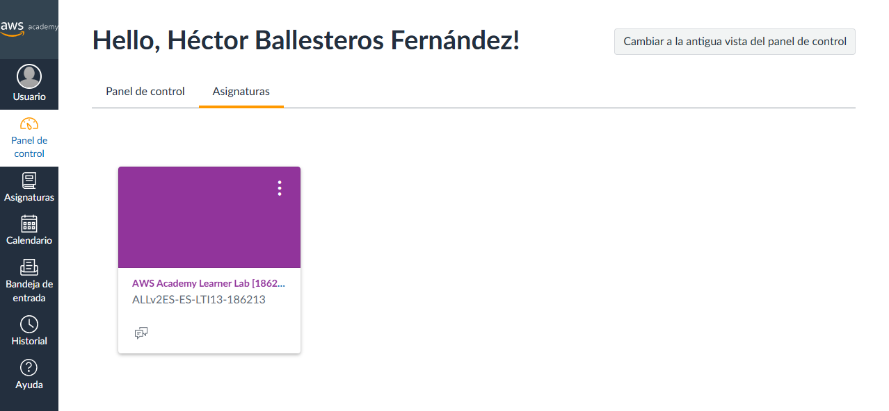

Nos desplazamos hacia abajo y en el apartado de Comenzar, clicamos en **Módulos**.

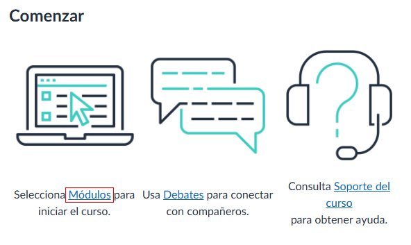

Ahora, nos iremos al apartado que pone **Laboratorio para el alumnado de AWS Academy** y clicamos en **Lanzamiento del Laboratorio para el alumnado de AWS Academy**.

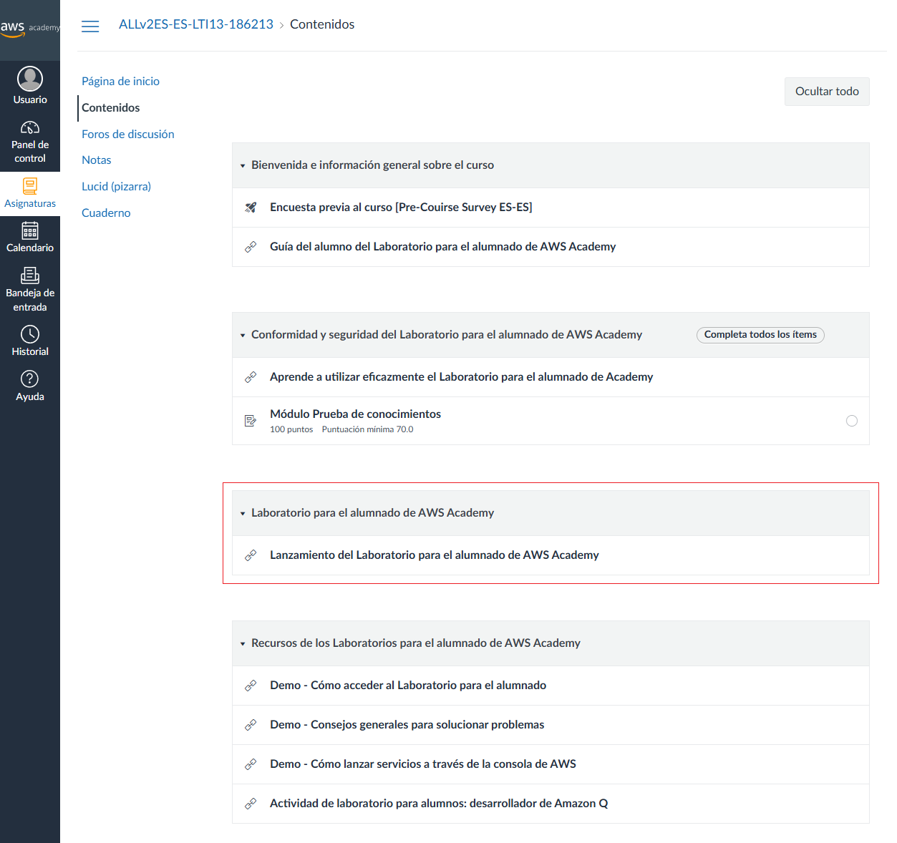

Cuando estemos dentro, clicaremos en el botón que pone **▶ Start Lab** y esperamos a que el botón de **AWS** pase de color rojo a color verde.  
Cuando esté de color verde, clicaremos ahora en **🛈 AWS Details** y nos saldrán los detalles del laboratorio. Dentro de los detalles, en el apartado de **Cloud Access**, en **AWS CLI:**, clicamos en el botón `Show` para que nos muestre las credenciales temporales.

## Fase 1: Interacción mediante la Consola Web (GUI)
Para entrar en la consola, tendremos que clicar en el botón de AWS teniendo el botón de color verde, si está en rojo no podremos entrar porque el laboratorio estaría apagado.  
Cuando hayamos clicado, nos saldrá una nueva ventana.

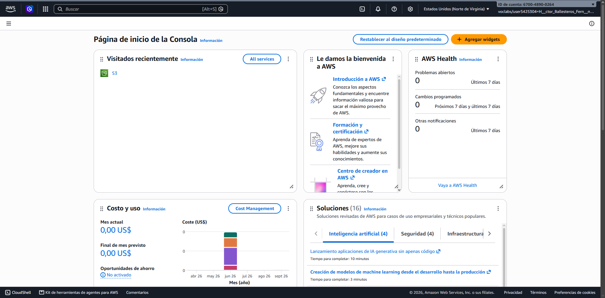

Vemos que ya tenemos el s3 instalado, pero para hacerlo, iremos al menú a la izquierda de la barra de búsqueda e iremos a **Almacenamiento > S3**.

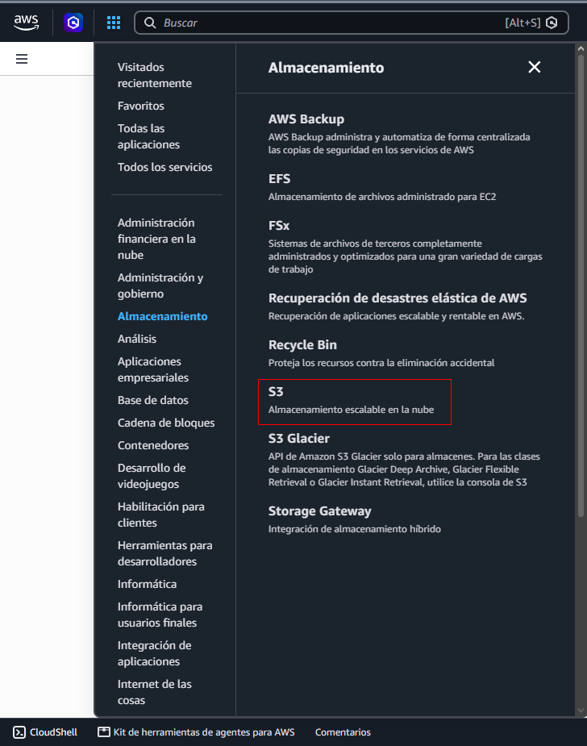

Cuando clicemos en **S3**, veremos lo que tenemos dentro, en mi caso, tengo 2 buckets creados.

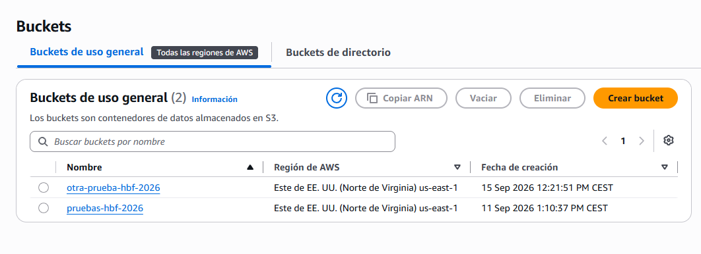

Para crear uno nuevo, clicamos en el botón de **Crear bucket**.

Ponemos un nombre que no esté repetido y dejamos todas las opciones por defecto.

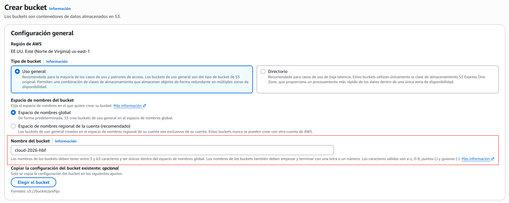

Cuando lo tengamos creado, entraremos en el directamente y veremos que no tiene contenido alguno.  
Para añadirle contenido, creamos un archivo **.txt** en nuestro equipo anfitrión y le pondremos el nombre de `bienvenida-gui.txt` y dentro de ese archivo pondremos el contenido, que en este caso será `Creado desde la interfaz web`.  
Cuando lo tengamos, clicamos en el botón de **Cargar** y se abrirá otra ventana, podemos arrastrar el archivo hacia nuestro bucket para cargar los archivos.

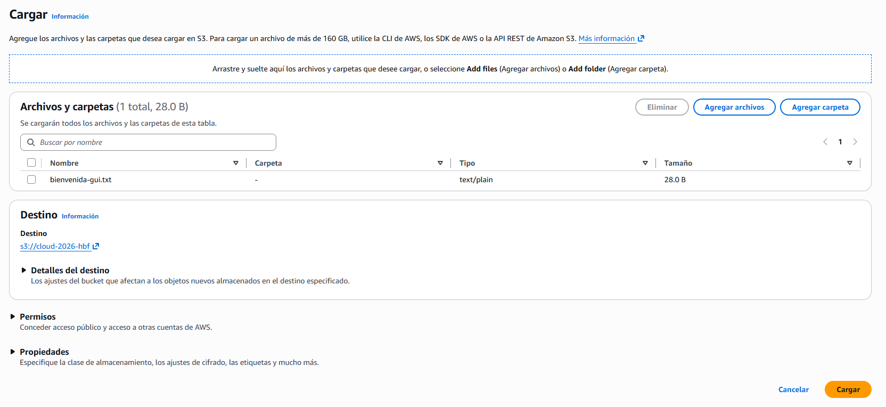

Volvemos a clicar en **Cargar** y nos saldrá una barra de carga arriba, cuando haya acabado volvemos a nuestro bucket y veremos que se ha cargado el archivo correctamente.

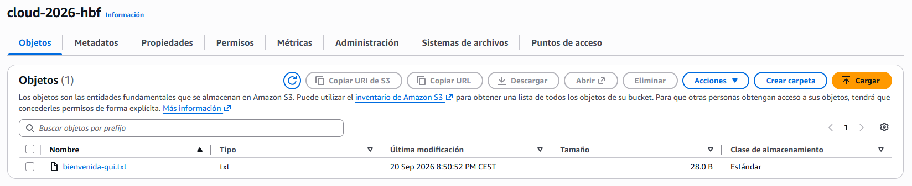

Para ver su contenido, seleccionamos el archivo y luego en el botón de Abrir. Se nos abrirá otra pestaña y veremos el contenido que tiene dentro.

## Fase 2: Interacción mediante CLI con AWS CloudShell
En la barra superior, a la izquierda de las notificaciones, veremos el icono de la terminal, clicamos en él y esperamos a que se nos conecte la terminal. Después, pondremos los siguientes comandos:
```bash
~ $ aws sts get-caller-identity
{
    "UserId": "AROAZYAQG2SUHVIKOJOLE:user5425304=H__ctor_Ballesteros_Fern__ndez",
    "Account": "670048900264",
    "Arn": "arn:aws:sts::670048900264:assumed-role/voclabs/user5425304=H__ctor_Ballesteros_Fern__ndez"
}
```

Este comando nos devuelve la información de nuestra cuenta de AWS.
```bash
~ $ aws s3 mb s3://asir-hector-cli --region us-east-1
make_bucket: asir-hector-cli
```

Este segundo comando, creamos el bucket en la región **us-east-1** con el nombre de **asir-hector-cli**.
```bash
~ $ echo "Hola AWS CLI desde CloudShell" > mensaje-cli.txt
```

Con este comando escribimos dentro de un archivo **.txt** llamado `mensaje-cli.txt` y que el contenido que tendrá dentro es `Hola AWS CLI desde CloudShell`.
```bash
~ $ aws s3 cp mensaje-cli.txt s3://asir-hector-cli/
upload: ./mensaje-cli.txt to s3://asir-hector-cli/mensaje-cli.txt
```

Este comando sirve para subir los archivos que hemos creado al bucket.
```bash
~ $ aws s3 ls s3://asir-hector-cli/
2026-09-20 19:13:34         30 mensaje-cli.txt
```

Y con este último comando veremos la información de los archivos que tenemos en el bucket.  
Vamos a nuestros buckets y veremos que se ha creado correctamente.

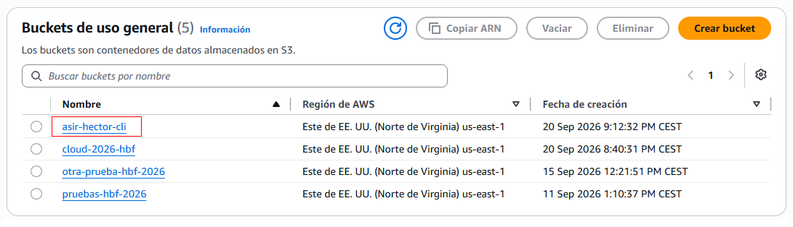

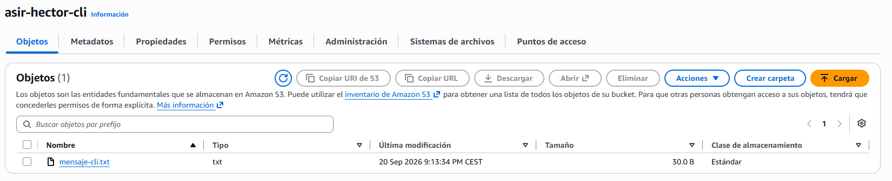

Al abrir el archivo, veremos que contiene lo siguiente:  
Hola AWS CLI desde CloudShell

## Fase 3: Interacción mediante SDK con Python (Boto3) en Docker
Abrimos Docker Desktop e iniciamos el contenedor de Jupyter.  
Abrimos la terminal del Docker y escribimos el siguiente comando para entrar en el conetedor:
```poweshell
docker exec -ti <container id> bash
```

Dentro del conetedor pondremos los siguientes comandos:
```bash
cd                          # Nos vamos al directorio raíz del conetedor
mkdir .aws                  # Creamos la carpeta en el directorio raíz
ls -a                       # Comprobar que el directorio .aws se haya creado
cd .aws                     # Iremos hacia el directorio creado
nano credentials            # Dentro pegamos toda la información del laboratorio de AWS
cat credentials             # Para comprobar que se haya pegado todo en el archivo
```

Vamos al navegador y escribimos `http://localhost:8888` para abrir Jupyter, nos pedirá que ingresemos un token. Para ello, clicamos en el nombre del contenedor y veremos un enlace en el que pone `token=xxx`. Entramos en el enlace y copiamos la URL desde después del sigo igual hasta el final y lo ingresamos en Jupyter. No lo volverá a pedir.

Dentro de Jupyter, clicamos en el apartado de `Notebook > Python 3`. Se nos abrirá un bloc de notas en el que podemos escribir en varios lenguajes de código.

Instalamos **boto3** desde ese bloc de notas, escribimos el siguiente comando y lo ejecutamos con la combinación de teclas `ALT + Enter`:
```bash
!pip install boto3
```

Cuando se haya instalado **boto3**, pondremos lo siguiente en la siguiente línea:
```python
import boto3
s3_client = boto3.client('s3', region_name="us-east-1")

# Crear el bucket
bucket_name = "asir-hector-sdk"
s3_client.create_bucket(Bucket=bucket_name)
print(f"Bucket '{bucket_name}' creado con éxito.")

# Crear un archivo y subirlo al bucket
archivo_local = "datos_sdk.txt"
with open(archivo_local, "w") as f:
    f.write("Archivo subido mediante Python. Las credenciales se leyeron de ~/.aws/credentials.")

s3_client.upload_file(archivo_local, bucket_name, "datos_sdk.txt")
print(f"Archivo '{archivo_local}' subido correctamente.")

# Listar objetos del bucket para confirmar
respuesta = s3_client.list_objects_v2(Bucket=bucket_name)
print("\nObjetos en el bucket:")
for obj in respuesta.get('Contents', []):
    print(f" - {obj['Key']} ({obj['Size']} bytes)")
```

Después de ejecutarlo, podremos ver el siguiente mensaje:
```
Bucket 'asir-hector-sdk' creado con éxito.
Archivo 'datos_sdk.txt' subido correctamente.

Objetos en el bucket:
 - datos_sdk.txt (82 bytes)
```

Podremos ver que se pueden instalar paquetes y escribir comandos desde el mismo lugar.

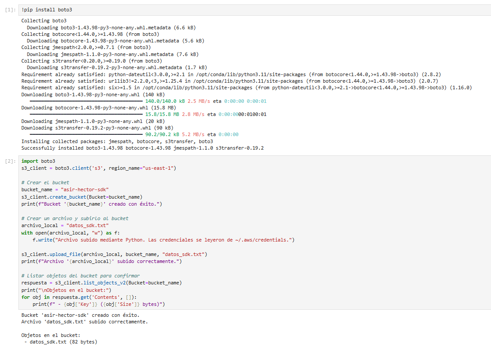

Si volvemos ahora al bucket, podremos ver que se ha creado correctamente y el archivo que hemos creado y subido.

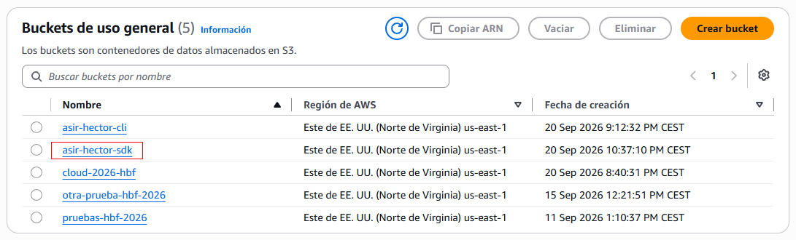

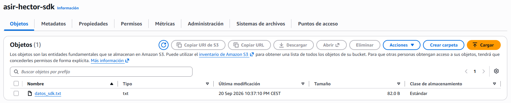

Si lo abrimos, se nos descarga y el contenido que tiene dentro es este:  
Archivo subido mediante Python. Las credenciales se leyeron de ~/.aws/credentials.

## Fase 4: Tarea final y limpieza de recursos


[Volver a la página anterior](../index.md)