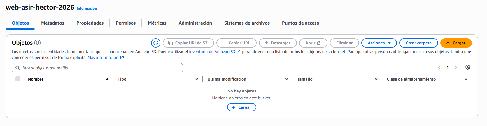
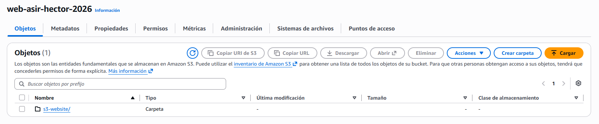
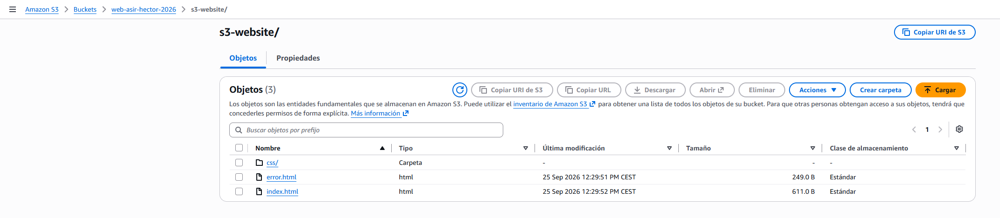
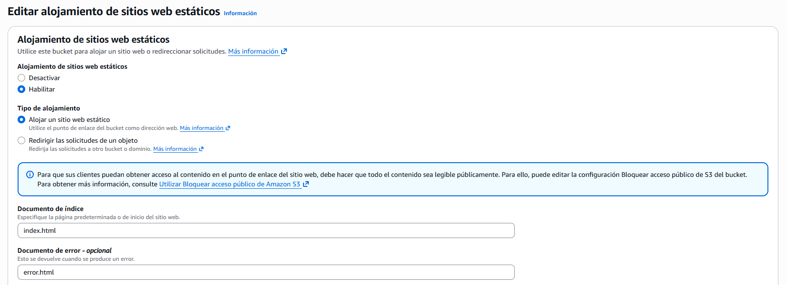
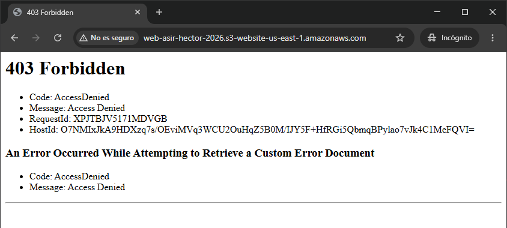
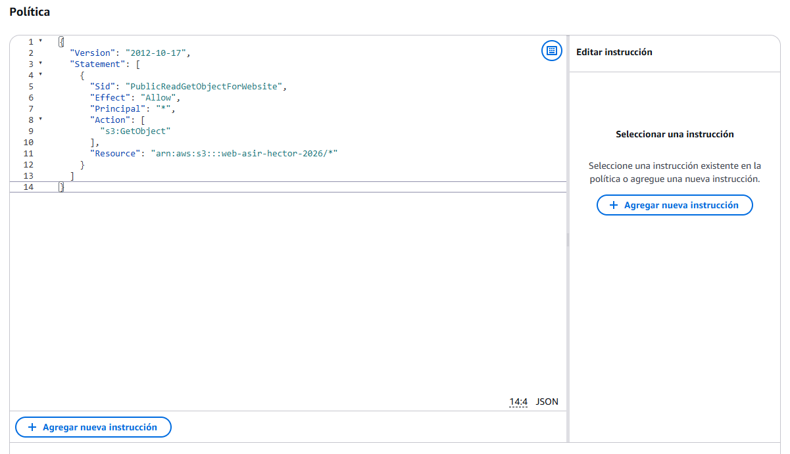

# PR0201: Despliegue de sitio web estático en AWS S3

## 1. Preparación del entorno local
Crearemos desde nuestra máquina anfitriona tres páginas web en una carpeta llamada `s3-website` para más tarde subirlas a nuestro **S3**. Las páginas son las siguientes:
### - index.html
```html
<!DOCTYPE html>
<html lang="es">
<head>
    <meta charset="UTF-8">
    <title>Servicio Web Estático - ASIR Cloud</title>
    <link rel="stylesheet" href="css/estilos.css">
</head>
<body>
    <header>
        <h1>Infraestructura Web sobre Amazon S3</h1>
        <p>Alojamiento sin servidor (Serverless Object Storage)</p>
    </header>
    <main>
        <section>
            <h2>Información del Nodo</h2>
            <p>Este sitio se sirve directamente mediante Amazon S3 Website Endpoint sin intermediación de servidores Apache o Nginx.</p>
        </section>
    </main>
</body>
</html>
```

### - error.html
```html
<!DOCTYPE html>
<html lang="es">
<head>
    <meta charset="UTF-8">
    <title>404 - Recurso No Encontrado</title>
</head>
<body>
    <h1>Error 404</h1>
    <p>El objeto o clave solicitado no existe en este bucket de S3.</p>
</body>
</html>
```

### - css/estilos.css
```css
body {
    font-family: Arial, sans-serif;
    margin: 40px;
    background-color: #f4f6f8;
    color: #333;
}
header {
    border-bottom: 2px solid #232f3e;
    padding-bottom: 10px;
}
```

## 2. Desarrollo de la práctica
### Fase 1: Creación del bucket S3
Creamos el bucket en nuetro **S3** con las siguientes condiciones:
- **Tipo de bucket:** Uso general.
- **Nombre del bucket:** web-asir-hector-2026
- **Región:** us-east-1 (Norte de Virginia).
- **Propiedad de objetos:** ACL deshabilitadas (recomendado).
- **Bloquear todo el acceso público:** Dejar marcada la casilla de bloqueo total.



### Fase 2: Subida y snálisis de objetos
Subimos la carpeta junto con los archivos que se crearon al principio a nuestro S3 recién creado.





Si abrimos solamente el archivo `index.html` desde el botón que pone **Abrir** desde nuestro bucket. Podemos verlo sin problemas porque se está haciendo una vista previa del archivo.

Si seleccionamos todos los archivos y lcicamos en el botón de Copiar URL. Nos saldrá un error en formato XML que es el siguiente:
```xml
This XML file does not appear to have any style information associated with it. The document tree is shown below.

<Error>
<Code>AccessDenied</Code>
<Message>Access Denied</Message>
<RequestId>NHKP0J2DFXD6E5DY</RequestId>
<HostId>HDGksobXgizfIk7bzR9Fn0ffVhuLenl33Nv/tTqGW9fOLFDuyarqEyXvd4LFP7HMUjCLeKLKmgI=</HostId>
</Error>
```

Este error nos indica que no tenemos los permisos necesarios para poder abrir los archivos. Esto se puede solucionar en la siguiente fase.

### Fase 3: Habilitación de “Static Website Hosting”
Dentro del bucket, nos iremos a la pestaña de **Propiedades**. Dentro, nos movemos hacia el apartado de **Alojamiento de sitios web estáticos** y clicamos en **Editar**.  
Clicamos en **Habilitar** y se nos abrirán más opciones. Haremos las siguientes configuraciones:
- **Tipo de alojamiento:** Alojar un sitio web estático.
- **Documento de índice:** index.html.
- **Documento de error:** error.html.



Con esta configuración, se habrá generado el Endopint del sitio web. Intentaremos acceder con el siguiente enlace: `http://web-asir-hector-2026.s3-website-us-east-1.amazonaws.com/`. Veremos que nos ha dado el siguiente error:



Tenemos este error porque hemos creado el bucket privado.

### Fase 4: Desbloqueo y Política de Acceso JSON
Dentro del bucket, nos iremos a la pestaña de **Permisos**. Dentro, nos movemos hacia el apartado de **Bloquear acceso público (configuración del bucket)** y clicamos en **Editar**, desmarcamos la casilla de `Bloquear todo el acceso público` y guardamos los cambios. Nos saldrá una ventana en la que tendremos que escribir *confirmar* para guardar los cambios.  
Dentro de **Permisos**, buscaremos ahora el apartado de **Política de bucket** y clicamos en **Editar**. Copiamos el siguiente código y lo pegamos en el apartado de **Política**:
```json
  {
    "Version": "2012-10-17",
    "Statement": [
      {
        "Sid": "PublicReadGetObjectForWebsite",
        "Effect": "Allow",
        "Principal": "*",
        "Action": [
          "s3:GetObject"
        ],
        "Resource": "arn:aws:s3:::web-asir-hector-2026/*"
      }
    ]
  }
```



Guardamos los cambios y volveremos a entrar en el enlace que antes nos daba el error 403.


[Volver a la página anterior](../index.md)