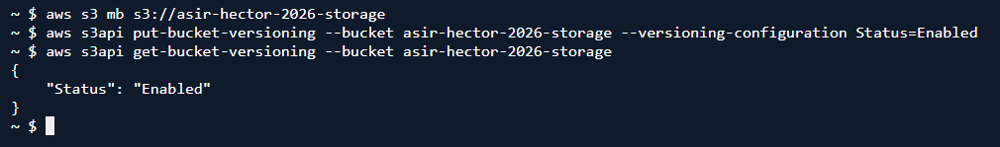
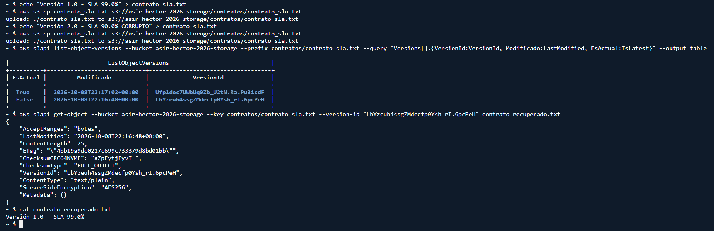
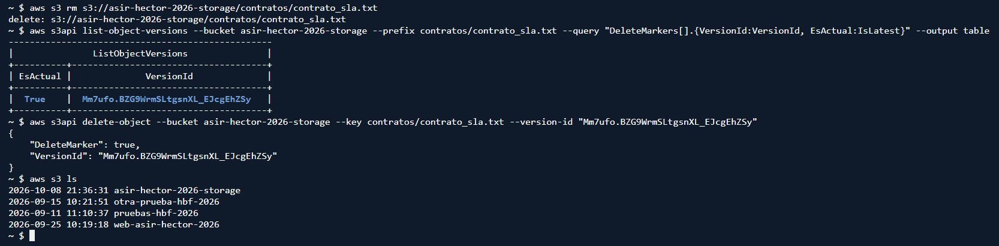
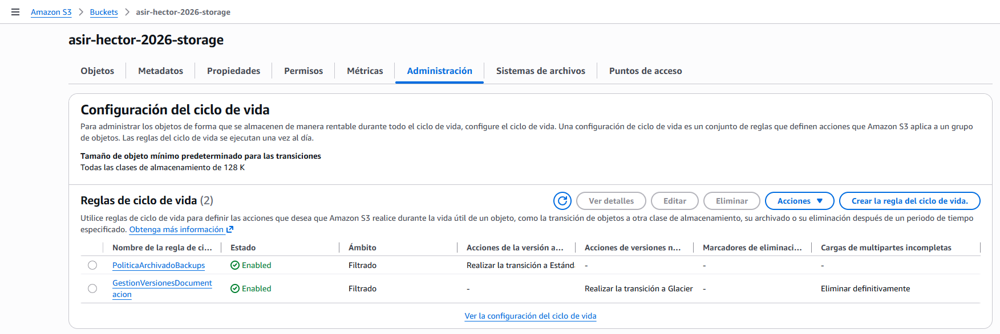
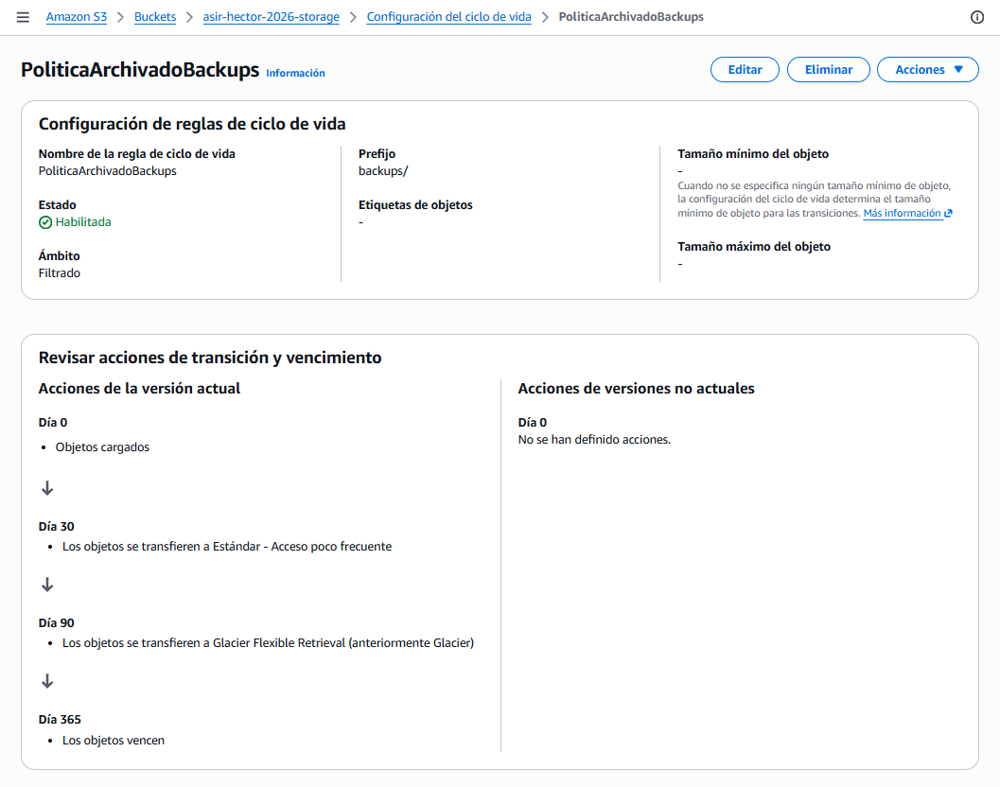
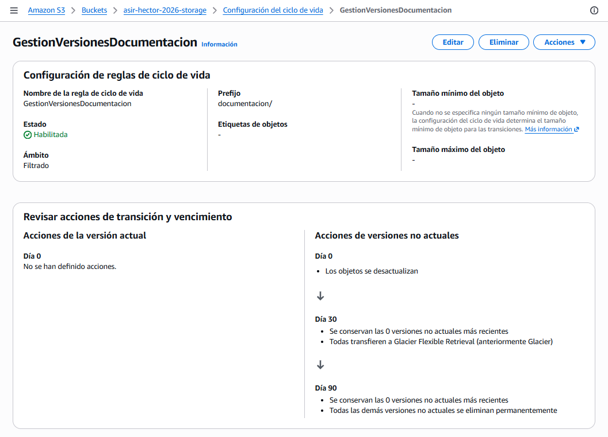

# PR0203: Protección contra desastres y optimización de almacenamiento

## Fase 1: Creación del repositorio y activación de versionado
**1. Creación del bucket:**

Utilizando la terminal de AWS, crearemos el bucket con acceso al público utilizando el siguiente comando:
```bash
aws s3 mb s3://asir-hector-2026-storage
```

**2. Activación de versionado:**

Pondremos el siguiente comando para habilitar el versionado o también desde la pestaña de Propiedades de la consola:
```bash
aws s3api put-bucket-versioning --bucket asir-hector-2026-storage --versioning-configuration Status=Enabled
```

**3. Verificación:**
```bash
aws s3api get-bucket-versioning --bucket asir-hector-2026-storage
```



## Fase 2: Simulación de sobreescritura y recuperación de versiones
**1. Generación y carga de la primera versión:**
```bash
echo "Versión 1.0 - SLA 99.0%" > contrato_sla.txt

aws s3 cp contrato_sla.txt s3://asir-hector-2026-storage/contratos/contrato_sla.txt
```

**2. Sobreescritura accidental:**
```bash
echo "Versión 2.0 - SLA 90.0% CORRUPTO" > contrato_sla.txt

aws s3 cp contrato_sla.txt s3://asir-hector-2026-storage/contratos/contrato_sla.txt
```

**3. Inspección de versiones:**
```bash
aws s3api list-object-versions --bucket asir-hector-2026-storage --prefix contratos/contrato_sla.txt --query "Versions[].{VersionId:VersionId, Modificado:LastModified, EsActual:IsLatest}" --output table
```

**4. Recuperación de la versión original:**
```bash
aws s3api get-object --bucket asir-hector-2026-storage --key contratos/contrato_sla.txt --version-id "LbYzeuh4ssgZMdecfp0Ysh_rI.6pcPeH" contrato_recuperado.txt

cat contrato_recuperado.txt
```



## Fase 3: Simulación de borrado y análisis de marcas de borrado
**1. Borrado simple del objeto:**
```bash
aws s3 rm s3://asir-hector-2026-storage/contratos/contrato_sla.txt
```

**2. Auditoría forense con `list-object-versions`:**
```bash
aws s3api list-object-versions --bucket asir-hector-2026-storage --prefix contratos/contrato_sla.txt --query "DeleteMarkers[].{VersionId:VersionId, EsActual:IsLatest}" --output table
```

**3. Restauración del objeto:**
```bash
aws s3api delete-object --bucket asir-hector-2026-storage --key contratos/contrato_sla.txt --version-id "Mm7ufo.BZG9WrmSLtgsnXL_EJcgEhZSy"
```

**4. Verificación:**
```bash
aws s3 ls
```



## Fase 4: Configuración de políticas de ciclo de vida (Lifecycle Rules)
**1. Creación del fichero `lifecycle_policy.json`:**
```bash
nano lifecycle_policy.json
```

Fichero a pegar:
```json
{
  "Rules": [
    {
      "ID": "PoliticaArchivadoBackups",
      "Filter": {
        "Prefix": "backups/"
      },
      "Status": "Enabled",
      "Transitions": [
        {
          "Days": 30,
          "StorageClass": "STANDARD_IA"
        },
        {
          "Days": 90,
          "StorageClass": "GLACIER"
        }
      ],
      "Expiration": {
        "Days": 365
      }
    },
    {
      "ID": "GestionVersionesDocumentacion",
      "Filter": {
        "Prefix": "documentacion/"
      },
      "Status": "Enabled",
      "NoncurrentVersionTransitions": [
        {
          "NoncurrentDays": 30,
          "StorageClass": "GLACIER"
        }
      ],
      "NoncurrentVersionExpiration": {
        "NoncurrentDays": 90
      },
      "AbortIncompleteMultipartUpload": {
        "DaysAfterInitiation": 7
      }
    }
  ]
}
```

**2. Aplicar la directiva:**
```bash
aws s3api put-bucket-lifecycle-configuration --bucket asir-hector-2026-storage --lifecycle-configuration file://lifecycle_policy.json
```

**3. Validar la directiva aplicada:**
```bash
aws s3api get-bucket-lifecycle-configuration --bucket asir-hector-2026-storage
```

Resultado:
```json
{
    "TransitionDefaultMinimumObjectSize": "all_storage_classes_128K",
    "Rules": [
        {
            "Expiration": {
                "Days": 365
            "Filter": {
                "Prefix": "backups/"
            },
            "Status": "Enabled",
            "Transitions": [
                {
                    "Days": 30,
                    "StorageClass": "STANDARD_IA"
                },
                {
                    "Days": 90,
                    "StorageClass": "GLACIER"
                }
            ]
        },
        {
            "ID": "GestionVersionesDocumentacion",
            "Filter": {
                "Prefix": "documentacion/"
            },
            "Status": "Enabled",
            "NoncurrentVersionTransitions": [
                {
                    "NoncurrentDays": 30,
                    "StorageClass": "GLACIER"
                }
            ],
            "NoncurrentVersionExpiration": {
                "NoncurrentDays": 90
            },
            "AbortIncompleteMultipartUpload": {
                "DaysAfterInitiation": 7
            }
        }
    ]
}
```

**4. Comprobación visual:**

Entramos en nuestro bucket y vamos a la pestaña **Administración**.



Si entramos en cada una de ellas, veremos un resumen de lo que hace cada una.





## Fase 5: Estudio económico y comparativa de costes
Políticas del departamento financiero de la región `us-east-1`:

|Clase de almacenamiento         |Coste aprox. ($/GB/mes)|Tiempo mínimo de facturación|Tamaño mínimo facturable|Tiempo de recuperación (Retrieval)|
|--------------------------------|-----------------------|----------------------------|------------------------|----------------------------------|
|**S3 Standard**                 |~$0.023                |Ninguno                     |Ninguno                 |Inmediato(milisegundos)           |
|**S3 Standard-IA**              |                       |                            |                        |                                  |
|**S3 Glacier Flexible Retrival**|                       |                            |                        |                                  |
|**S3 Glacier Deep Archive**     |                       |                            |                        |                                  |

### Preguntas de análisis
**1. Riesgo de microficheros en clases IA/Glacier:** si una aplicación sube 500.000 ficheros de log de 2 KB cada uno a **S3 Standard-IA**, ¿por qué aumentaría la factura en lugar de reducirse?
- a

**2. Borrado prematuro:** si un script de backup elimina un fichero de 10 GB en **S3 Glacier Flexible Retrieval** solo 15 días después de haberlo subido, ¿cuántos días adicionales cobrará AWS en concepto de penalización por borrado temprano?
- a

**3. Cálculo de ahorro:** una empresa almacena 20 TB de copias de seguridad estáticas que casi nunca se leen. ¿Cuánto pagaría al mes en **S3 Standard** frente a mantenerlas en **S3 Glacier Flexible Retrieval**?
- a

[Volver a la página anterior](../index.md)